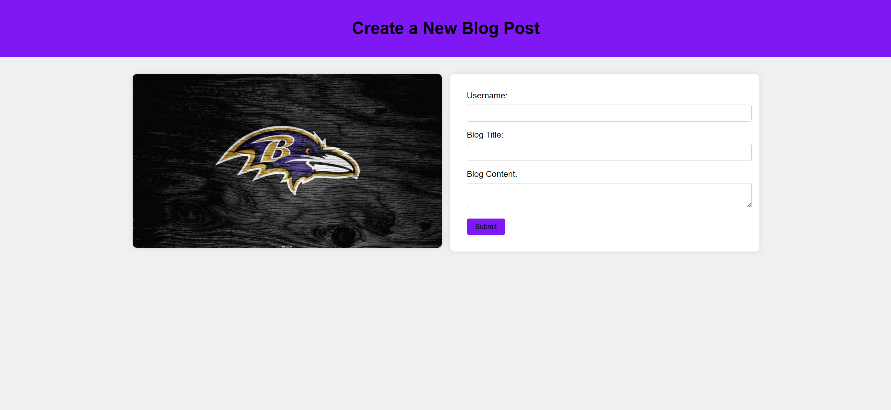
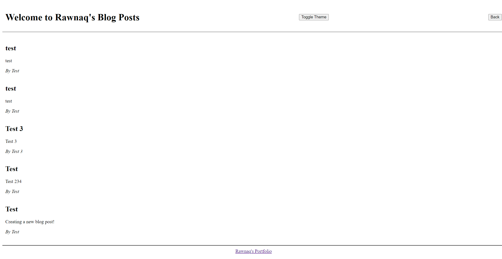

# My-Blog
My personal blog 

## Description
A two-page website to post about my personal experiences throughout the bootcamp and view the saved blog posts after each input.

## Installation
N/A

## Usage
To input day to day blog posts regarding my daily activities. Anything new I've learned over the course of my Bootcamp experience. Include a title, author, and content for each post. After clicking on the "submit" button the page will redirect to another website that shows all the saved blog posts. At the top of the page is a "Toggle Theme" button to change the page to Dark/Light theme. At the bottom of the page is a link that directs to Rawnaq's Portfolio.

## Preview

[Click here to preview My Blog website](https://rawnaqk.github.io/My-Blog/)

## Credits
N/A

## License
Please refer to the LICENSE in the repo.